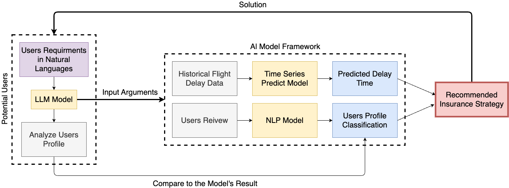

# Travel Insurance Recommendation AI System

## Introduction

As the economy and aviation industry develops, more and more people choose to travel by plane for leisure and business trips. As a result, flight delays have become a major source of conflict between passengers and airlines, delays always cause much loss to the airlines, and lead to negative emotions to passengers. Flight delays disrupt passengers' travel plans. Consequently, flight delay insurance emerged, underwriting the airline's on-time departure credibility to compensate passengers for delays, mitigating their inconvenience. While sold as a standalone policy, it is often offered as a supplementary coverage to travel accident insurance. However, nowadays many airlines cannot provide great delay prediction values as a reference for passengers, but only calculate the average value based on historical records, which reveals that there exists an urgent need to develop better insurance strategies.
  
Therefore, Our project will design a new Al system to predict flight delays and price the insurance, enabling the airlines can provide personalized insurance recommendations for passengers. This Al system will analyze the rates of flight delays based on multiple relevant data, such as flight dynamic data, city weather, and special situations data. Besides, it will construct user profiles with sentiment analysis based on users' feedback to airlines. Finally, the system will offer a personalized and optimal insurance recommendations, contributing to supplying a suitable service for each customer and gaining more benefits for airlines. Through personalized insurance recommendations, our AI system can boost customer satisfaction and loyalty while reducing stress caused by flight delays. Our system could reshape customer service in the airline industry and promote a positive image and competitive edge for airlines, resulting from focusing on prediction accuracy and user interaction quality.

## Team Member

## Dataset

[Twitter US Airline Sentiment](https://www.kaggle.com/datasets/crowdflower/twitter-airline-sentiment?resource=download&select=Tweets.csv)

[InsuranceCorpus](https://huggingface.co/datasets/Ddream-ai/InsuranceCorpus)

[United States Department of Transportation](https://www.transtats.bts.gov/databases.asp?Z1qr_VQ=E&Z1qr_Qr5p=N8vn6v10&f7owrp6_VQF=D)

## Framework

## How to run this project
